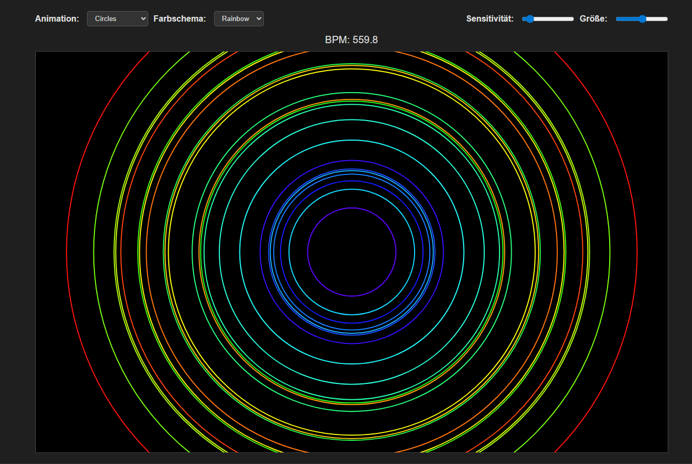
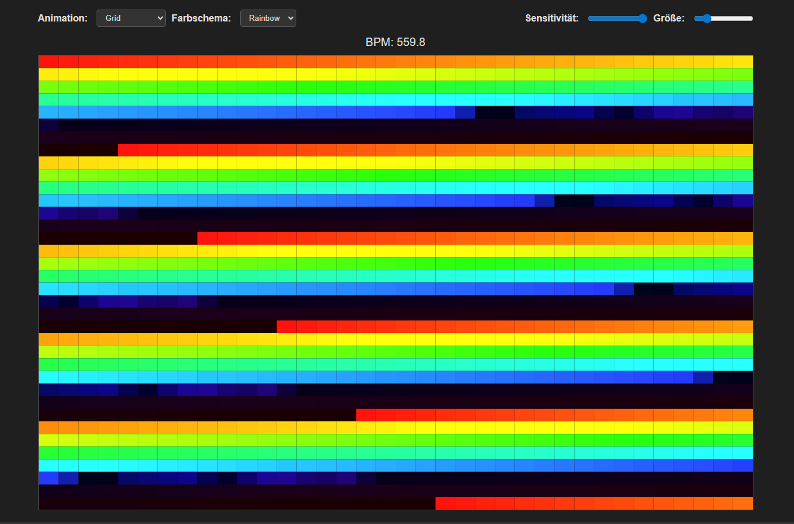
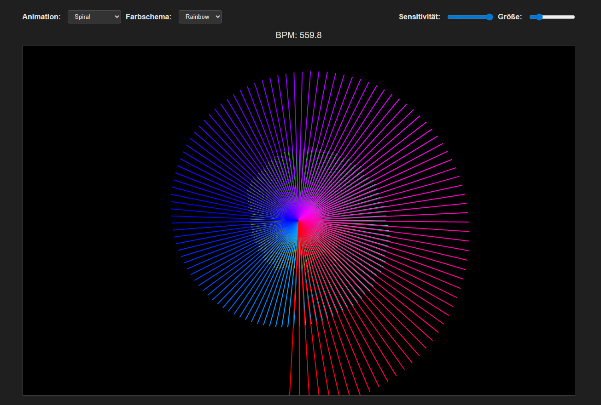
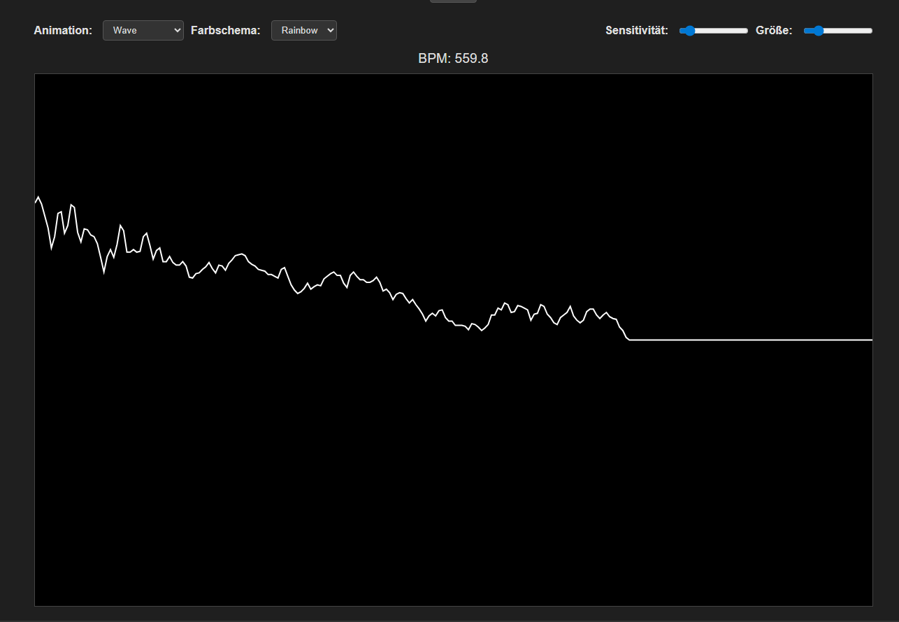
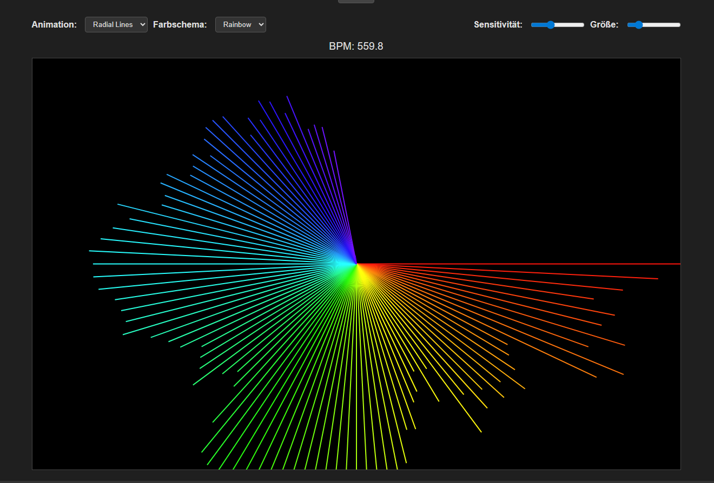
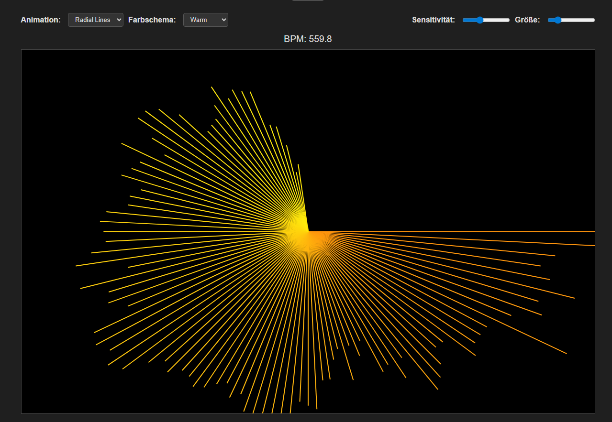
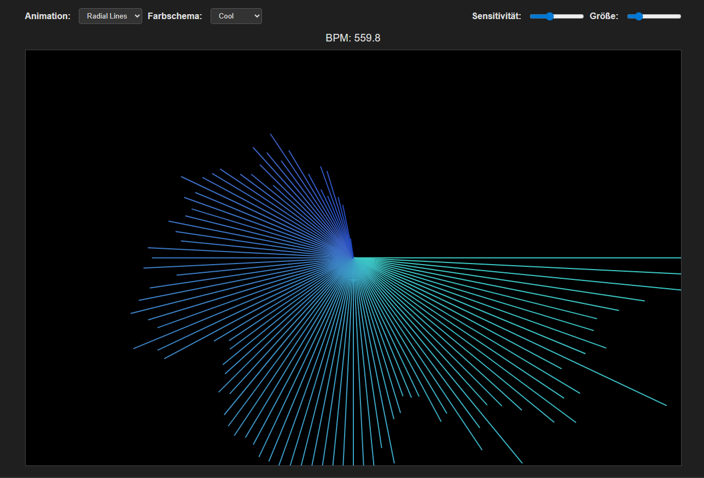

# AuTune Online - Audio Visualizer Pro

Ein professionelles, webbasiertes Audio-Visualisierungs-Tool mit BPM-Erkennung und verschiedenen Darstellungsmodi.

## 🎨 Visualisierungs-Modi

Entdecke verschiedene Arten, deine Musik zu sehen:

| Circles | Grid |
|:---:|:---:|
|  |  |

| Spiral | Waves |
|:---:|:---:|
|  |  |

## 🌈 Farbschemata

Passe die Stimmung mit verschiedenen Farbmodi an (z.B. Radial Lines):

| Rainbow | Warm |
|:---:|:---:|
|  |  |

| Cool | Happy |
|:---:|:---:|
|  |  |

## ✨ Features

- 🎵 **MP3-Upload**: Einfach per Drag & Drop oder Dateiauswahl
- 📊 **Frequenzanalyse**: Echtzeit-Analyse via Web Audio API
- 🥁 **BPM-Erkennung**: Automatische Tempo-Erkennung
- 🎨 **Visuelle Effekte**: Bars, Partikel, Kreise, Wellen, Spiralen, Grid
- ⌨️ **Steuerung**: Tastatur-Shortcuts (Space, Pfeiltasten) und Accessibility-Support

## Quick Start

# Installieren
npm install

# Starten
npm start

# Im Browser öffnen
http://localhost:3000

## MCP Server (Model Context Protocol)

Dieser Workspace enthält einen MCP-Server, der kompatible Clients (z. B. VS Code / Copilot MCP, Claude Code, MCP Inspector) mit Automations- und Analyse-Tools versorgt: Performance-Audits, Code-Formatierung, BPM-Analyse, Issues & Pull Requests.

### Umgebung / .env

Erstelle eine Datei `.env` (oder nutze die bereitgestellte `.env.example`) mit:

```
GITHUB_TOKEN=ghp_XXXXXXXXXXXXXXXXXXXXXXXXXXXX   # benötigt: repo Inhalte + Issues (classic oder fine-grained)
GITHUB_REPO=DeinGithubUser/DeinRepoName         # z.B. MaximilianHaak/AuTuneOnline
MCP_PORT=3333                                   # optional, Standard 3333
```

Notwendige GitHub‑Scopes (klassischer Token): `repo` reicht (enthält Issues & Contents). Bei Fine‑grained Token: Inhalte lesen/schreiben + Issues schreiben.

### Starten

1. `npm install` (falls noch nicht geschehen)
2. `.env` befüllen
3. `npm run mcp`
4. Endpoint: `http://localhost:3333/mcp`

### Verfügbare Tools (aktuell)

| Tool | Zweck |
|------|-------|
| `list_files(pattern)` | Glob-Suche (ignoriert `node_modules`, `.git`). |
| `read_file(path)` | Liest Datei (ab 50KB gekürzt). |
| `suggest_visualizer_improvements()` | Heuristische Performance/UX Tipps für `public/app.js`. |
| `create_github_issue(owner, repo, title, body?, labels?)` | Erstellt GitHub Issue. |
| `commit_and_push(message?, addPattern?)` | Führt Git Add/Commit/Push aus. |
| `format_code(path)` | Formatiert Datei mit Prettier API (automatische Config-Erkennung). |
| `lighthouse_audit(url, categories?)` | Startet Headless Chrome & führt Lighthouse aus (Scores & Warnungen). |
| `analyze_bpm(path)` | Offlines BPM-Erkennung: decodiert Audio + Onset-Erkennung + MusicTempo. |
| `open_pull_request(title, body?, base?, head?)` | Erstellt Pull Request via Octokit. |

### Beispiel-Nutzung (JSON-RPC Request Body für HTTP)

```json
{
	"jsonrpc": "2.0",
	"id": 1,
	"method": "tools.invoke",
	"params": {
		"name": "lighthouse_audit",
		"arguments": {
			"url": "http://localhost:3000",
			"categories": ["performance","accessibility"]
		}
	}
}
```

### Connection in VS Code (MCP-kompatibel)

CLI-Beispiel:

```
code --add-mcp "{\"name\":\"autune\",\"type\":\"http\",\"url\":\"http://localhost:3333/mcp\"}"
```

Alternativ: MCP Inspector (`npx @modelcontextprotocol/inspector`) öffnen und Endpoint eintragen.

### Hinweise zu den Tools & externen Paketen

- **Prettier**: Verwendet `prettier.resolveConfig(filepath)` + `prettier.format`. Parser wird automatisch anhand Dateiendung bestimmt.
- **Lighthouse**: Headless Chrome via `chrome-launcher`. Konfigurationsoption `onlyCategories` reduziert Laufzeit. Node >= 22 empfohlen (Upgrade auf Lighthouse v13 möglich). Bei Bedarf Chrome Flags ergänzen (`--no-sandbox` in restriktiven Umgebungen).
- **BPM Analyse**: `audio-decode` dekodiert (`wav`, `mp3`, `ogg/vorbis`, `flac`, `opus`, `qoa`). Danach einfache Energie-Onset-Erkennung (Fenster 1024 / Hop 512) -> Zeitstempel -> `music-tempo` Kandidaten.
- **GitHub**: Octokit REST (`@octokit/rest`) nutzt `GITHUB_TOKEN` für Auth; `open_pull_request` braucht zusätzlich `GITHUB_REPO=owner/repo`.

### Mögliche Erweiterungen

- Mehr Kategorien / Budgets: Lighthouse Scores in Issues mit Schwellwerten vergleichen.
- Batch-Audit: Mehrere Seiten (z.B. `/`, `/about`, `/visualizer`) nacheinander prüfen.
- Automatische Branch-Erstellung vor PR (z.B. Tool erweitern: erstellt Feature-Branch, führt Format + Audit aus, commit/push, dann PR).

### Verbindung in VS Code (MCP-kompatibel)

Wenn Ihre VS Code Version MCP-Server unterstützt, können Sie den Server via HTTP registrieren. Beispiel über die VS Code CLI:

```
code --add-mcp "{\"name\":\"autune\",\"type\":\"http\",\"url\":\"http://localhost:3333/mcp\"}"
```

Alternativen:
- MCP Inspector: `npx @modelcontextprotocol/inspector` und dann die URL `http://localhost:3333/mcp` verbinden.
- Claude Code / Cursor: Entsprechende UI nutzen, HTTP-MCP Endpoint hinzufügen.

# Features
1. BPM Detection – erkennt das ungefähre Tempo eines Songs.
2. Frequenz-Bars – Live-Audio-Spektrum wird animiert dargestellt.
3. Partikel-Effekt – reagiert auf Bass und BPM.

# ToDos / Erweiterungen
- Verschiedene Themes/Layouts
- Komplexere BPM-Algorithmen oder Integration von externen Services
- Speichern hochgeladener Files auf dem Server
- Benutzerverwaltung, Playlists, etc.
 - (Erledigt) MCP-Tool: Pull Requests erstellen
 - (Erledigt) MCP-Tool: Prettier Formatierung
 - (Erledigt) MCP-Tool: Lighthouse Audit
 - CI: Automatisierte Lighthouse Budgets & PR-Kommentare
 - OffscreenCanvas / WebWorker Rendering für weitere Performance
 - Responsive Themes + Accessibility Tests (axe / pa11y Integration)

# Lizenz
MIT

---

## Schlusswort

Damit hast du eine **vollständige**, **professionell strukturierte** Webanwendung, die du nach Belieben erweitern kannst – das Grundgerüst ist bereits „marktfähig“ in dem Sinne, dass  
1. Das **UI** modern und klar strukturiert ist,  
2. **Drag & Drop** und BPM-Erkennung ein wirklich **cooles** Feature-Set bieten,  
3. Du jederzeit **Skalieren** kannst (z.B. Datenbank, Cloud-Deploy, erweiterte Visuals etc.).  

> **Tipp**: In einem **echten Produktions-Setup** würde man die BPM-Erkennung wahrscheinlich ins Backend (Node.js) legen, da es im Browser teils performancekritisch ist. Man könnte die PCM-Daten (via `ArrayBuffer`) an einen `/analyze`-Endpoint senden, dort `music-tempo` anwenden, das Ergebnis (BPM) zurücksenden und es für die Visualisierung verwenden.  

Viel Erfolg beim **Finalisieren** – du hast jetzt eine **umfangreiche** Codebasis, die deinen Usern schon echt was hermacht!Test auto-update after workflow fix

Testing deploy trigger fix
